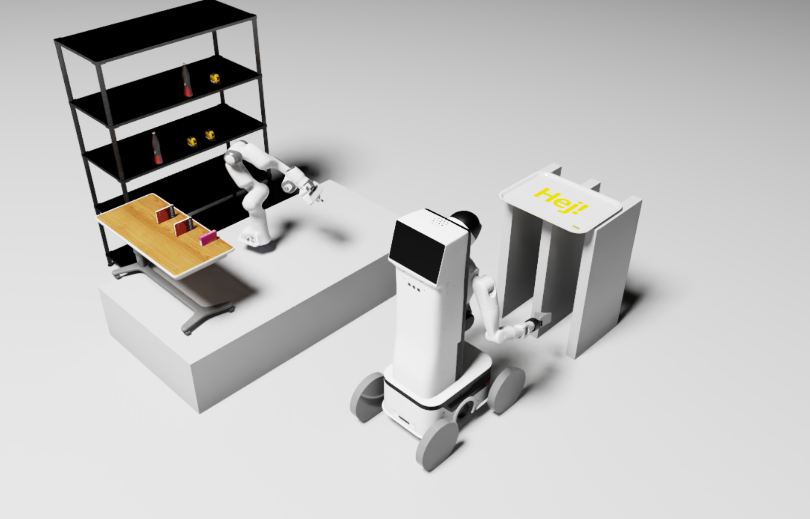
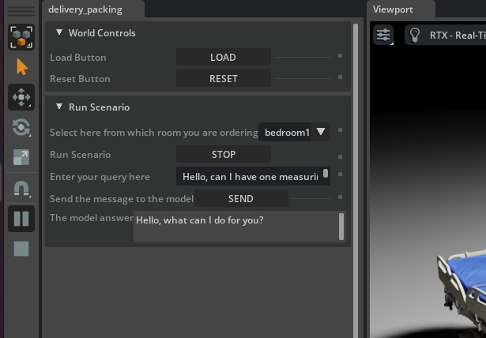

# delivery_packing_python  

This repository contains code for my participation in the **Lychee x Revel Hackathon** on **NVIDIA Isaac Sim 5.0.0**.

<p float="left">
  
  
</p>

The goal is to create a prototype for robotic manipulation where a user places an order using natural language. Two robots then collaborate: one places all objects on a tray, and the other transports the crate.

## Information  

- The project is designed to run fully locally, so you need at least a GPU with **4GB of VRAM** to run both the model and the simulation.  
- If you experience jerky movements, increase the number of solver steps (position and velocity) to stabilize the grasp.  

## Installation  

1. Clone this repository inside a folder linked to the Isaac Sim **Extension Manager** (by default: `isaacsim/extsUser`).  
2. Open Isaac Sim, go to the **Extension Manager**, search for `"delivery_packing"`, enable it, and set it to **Auto Load**. See this [tutorial](https://docs.isaacsim.omniverse.nvidia.com/5.0.0/utilities/updating_extensions.html) for more details.
3. The *delivery_packing* items should now appear in the toolbar menu. Click on it to load the extension.  
4. In parallel, install **Docker** on your machine following [this guide](https://docs.docker.com/engine/install/ubuntu/).  
5. Open a terminal inside the `agent` folder and run:  

```bash
   docker compose up
```




## Usage
- In Isaac Sim, load and run the `delivery_packing` extension (via the Extension Manager).  
- In the extension UI, enter your query in the input field and press **Send** to start the system.  
- The system will process the request and command the robots; response time may vary depending on your computer.


## Limitation / Future work
- Automatic grasp pose estimation.
- Autonomous navigation in complex environment.

## Author
**Loan BERNAT** 

<a href="https://www.youtube.com/@loanbernat8145">
  
</a> 
<a href="https://www.linkedin.com/in/loan-bernat-928b9a1b0/">
  
</a>

